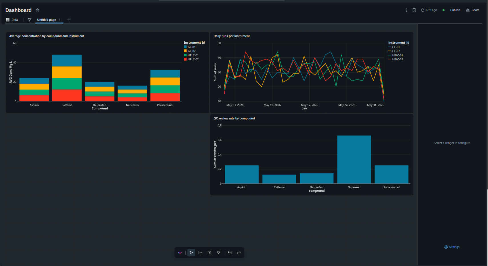

# Chromatography data pipeline (Databricks)

A medallion pipeline that ingests a lab instrument export, cleans and normalizes
it, and produces analytics tables and a dashboard. Built on Databricks Free Edition
with PySpark and Spark SQL.

## Pipeline
- **Bronze** — raw export landed as-is for traceability
- **Silver** — parsed two different date formats into one timestamp, normalized
  concentration units to mg/L, removed invalid readings and duplicates
- **Gold** — per-compound/instrument summary and a 3-sigma QC table

## Stack
PySpark, Spark SQL, Delta tables, Unity Catalog, AI/BI dashboards

## Dashboard

## Notes
Input data is synthetic and modelled on a typical HPLC/GC vendor export
(inconsistent date formats, mixed concentration units, missing values, duplicate
rows). The pipeline removed roughly 170 bad or duplicate rows out of ~4,100.

---

## Описание (RU)

Пайплайн обработки хроматографических данных по медальон-архитектуре: принимает
экспорт из лабораторного прибора, очищает и нормализует данные, строит
аналитические таблицы и дашборд. Реализовано на Databricks Free Edition с
использованием PySpark и Spark SQL.

### Слои
- **Bronze** — сырой экспорт сохраняется как есть, для прослеживаемости
- **Silver** — два разных формата дат сведены в один timestamp, единицы
  концентрации приведены к мг/л, удалены некорректные записи и дубликаты
- **Gold** — сводка по веществам и приборам плюс QC-таблица по правилу трёх сигм

### Стек
PySpark, Spark SQL, Delta-таблицы, Unity Catalog, AI/BI дашборды

### Примечание
Данные синтетические, смоделированы по типичному экспорту из HPLC/GC-систем
(разные форматы дат, смешанные единицы измерения, пропуски, дубликаты строк).
Пайплайн отсеял около 170 некорректных и дублирующихся строк из ~4100.

---

## Sipattama (KZ)

Medallion arhitekturasy boiynsha hromatografiyalyq derekterdi öñdeu paiplaini:
zerthanalyq qūryldynyñ eksportyn qabyldaidy, derekterdi tazalaidy jäne
qalpyna keltiredi, analitikalyq kestelermen dashbord qūraidy. Databricks Free
Edition platformasynda PySpark jäne Spark SQL kömegimen jüzege asyryldy.

### Qabattar
- **Bronze** — shikі eksport özgerissiz saqtalady, izdenuilik üshіn
- **Silver** — eki türli kün formaty bіr timestamp-qa keltіrіldі, konsentratsiya
  birlikterі mg/L-ge keltіrіldі, qate jazbalar men telnusqalar joiyldy
- **Gold** — zattar men qūryldylar boiynsha jiyntyq jäne üsh sigma erejesі
  boiynsha QC kestesі

### Stek
PySpark, Spark SQL, Delta kestelerі, Unity Catalog, AI/BI dashbordtary

### Eskertu
Derekter sintetikalyq, ädettegі HPLC/GC eksportyna ūqsas modeldengen (türli kün
formattary, aralas ölshem birlikterі, bos mänder, telnusqa joldar). Paipline
shamamen 4100 joldyñ ішіnen 170-tei qate jäne telnusqa joldy alyp tastady.
